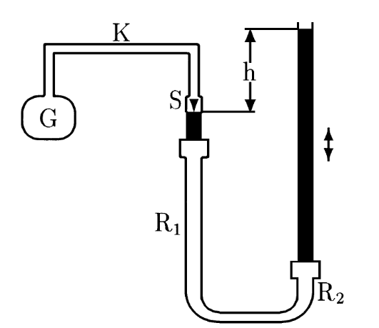

# Hinweise für den Versuch: "Ideales und reales Gas" 

##  Aufgabe 1: Gasthermometer

### Prinzip der Messung

Der grundsätzliche Aufbau des Gasthermometers und die im weiteren Verlauf verwendeten Bezeichnungen finden Sie in der folgenden Skizze: 



Die Temperaturmessung beruht auf der idealen Gasgleichung 
```math
\begin{equation*}
p(V, T) = \frac{n\,R\,T}{V},
\end{equation*}
```

wobei $p$ dem Druck, $V$ dem Volumen, $T$ der Temperatur, $n$ der Stoffmenge des Gases und $R$ der idealen Gaskonstanten entsprechen.

Das Thermometer wird nach dem Prinzip der Druckmessung bei konstantem Volumen verwendet. In diesem Fall gilt $p\propto T$ mit: 
```math
\left.p(T)\right|_{V=const.} = p_{0}\left(1+\alpha\,T\right). \qquad\text{(1)}
```

Die Steigung $\alpha$ wird als **Spannungskoeffizient** bezeichnet. Numerisch ist $\alpha$ zum Volumenausdehnungskoeffizienten des Gases äquivalent. Wenn Sie $T$ auf der Celsius-Skala messen entspricht $p_{0}$ dem Druck bei $0^{\circ}\mathrm{C}$. In diesem Fall verschwindet der Gasdruck $p(T_{0})$ bei einer Temperatur von $T_{0}=-1/\alpha$. Diese Temperatur wird als **absoluter Nullpunkt** bezeichnet.

Zur Messung tauchen Sie den Glaskolben G vollständig in ein [Wärmebad](https://de.wikipedia.org/wiki/W%C3%A4rmebad) ein, dass Sie mit destilliertem Wasser herstellen. Wenn Sie den Druck bei der Siede- ($T_{s}$) und Schmelztemperatur messen erhalten Sie eine Abschätzung $\alpha^{(0)}$ aus der Beziehung: 
```math
\begin{equation*}
\alpha^{(0)} = \frac{p(T_{s}) - p_{0}}{p_{0}\,T_{s}}
\end{equation*}
```

Wenn Sie $\alpha$ genauer bestimmen wollen, sollten Sie einige Effekte beachten, die Ihre Messung verfälschen können:

- G hat eine thermische Ausdehnung.
- G verformt sich unter Druck.
- Luft ist kein ideales Gas.
- Ein Teil des Gases befindet sich (bei Raumtemperatur) außerhalb von G.

Alle Effekte bis auf die thermische Ausdehnung von G sind allerdings sehr klein und können vernachlässigt werden. Einen Korrekturterm für die thermische Ausdehnung von G erhalten Sie aus der folgenden Überlegung: 

Bei $T_{s}$ hat sich das Volumen $V_{\mathrm{G}}$ von G um den Faktor 
```math
\begin{equation*}
\frac{V_{\mathrm{G}}^{\prime}}{V_{\mathrm{G}}} = 1+T_{s}\gamma
\end{equation*}
```

ausgedehnt, wobei Sie den kubischen Ausdehnungskoeffizient von Glas ($\gamma=2,5\times10^{-5}\,\mathrm{K}^{-1}$)  als gegeben voraussetzen können. Nach der idealen Gasgleichung ($p\,V=const.$) ist $p(T_{s})$ um den entsprechenden Faktor zu verringern. Aus Gleichung (1) ergibt sich damit:

```math
\begin{equation*}
\begin{split}
&p(T_{s}) = \frac{p_{0} + \alpha\,p_{0}\,T_{s}}{1+T_{s}\gamma}; \\
&\alpha = \frac{\left(1+T_{s}\gamma\right)\,p(T_{s})-p_{0}}{p_{0}\,T_{s}}; \\
&\hphantom{\alpha} = \frac{p(T_{s})-p_{0}}{p_{0}\,T_{s}} + \frac{p(T_{s})}{p_{0}}\gamma = \alpha^{(0)} + \frac{p(T_{s})}{p_{0}}\gamma \\
\end{split}
\end{equation*}
```

Beachten Sie außerdem, dass $T_{s}$ vom Umgebungsdruck abhängt. Sie können $T_{s}(p)$ mit Hilfe eines im Versuchsraum vorhandenen Barometers und der ebenfalls vorliegenden Dampfdruckkurve für Wasser bestimmen. Berücksichtigen Sie entsprechende Unsicherheiten in Ihrer Messung.   

### Hinweise zur Durchführung

Schieben Sie das Becherglas vorsichtig von unten her so hoch wie möglich über G. Füllen Sie es dann mit einem Gemisch aus fein zerstoßenem Eis und Wasser, so dass G möglichst ganz bedeckt ist. Rühren Sie die Mischung vorsichtig durch, so dass eine möglichst homogene Temperaturverteilung im Wärmebad entsteht. Schieben Sie, während sich das Gasthermometer abkühlt, R2 bis zum Anschlag nach unten um zu verhindern, dass Quecksilber in G eindringen kann. 

Nach $\approx15\,\mathrm{min}$ sollte die Luft in G die Temperatur des Wärmebads angenommen haben. Regeln Sie das Gasvolumen ein, indem Sie R2 langsam so weit nach oben verschieben, bis die Quecksilberkuppe in R1 die Spitze S gerade berührt. Aus der Höhendifferenz $\Delta h$ der beiden Quecksilberkuppen können Sie $p_{0}$ im Volumen $V$ bestimmen. Vergessen Sie nicht, dass auf die Quecksilberkuppe in R2 noch der äußere Luftdruck wirkt. Um den Druck in $\mathrm{mbar}$ zu erhalten verwenden Sie die Umrechnung: $1\,\mathrm{mm\,Hg} = 1,33322\,\mathrm{mbar}$. 

Bringen Sie danach das Wasserbad auf Siedetemperatur $T_{s}$. Achten Sie auch beim Heizen darauf, dass G immer vollständig mit Wasser bedeckt ist. Bevor Sie $p(T_{s})$ wie oben bestimmen, sollte das Wasser einige Minuten lang sieden.

---

## Aufgabe 2: Adiabatenexponent (nach [Clément-Desormes](https://de.wikipedia.org/wiki/Experiment_von_Cl%C3%A9ment-Desormes))

### Prinzip der Messung

Zustandsänderungen von Gasen, die ohne Wärmeaustausch mit der Umgebung ($\delta Q=0$) stattfinden, bezeichnet man als *adiabatisch*. Sie können mit Hilfe der Adiabatengleichungen
```math
\begin{equation*}
p\,V^{\kappa} = const.;\quad T\,V^{\kappa-1} = const.
\end{equation*}
```

beschrieben werden. 

Das Verfahren von Clément-Desormes zur Bestimmung von $\kappa$ wird mit einer Flasche durchgeführt, die mit dem zu untersuchenden Gas befüllt und einem U-Rohr-Manometer zur Druckmessung verbunden ist. Aus dem Anfangszustand $\left(\begin{array}{ccc}p_{0}& V_{0} & T_{0}\end{array}\right)$ gehen Sie wie folgt vor:

1. Erzeugen Sie mit dem Handblasebalg einen (nicht zu großen) Überdruck $\Delta p_{1}$ in der Flasche. Warten Sie den Temperaturausgleich ab. Das System hat daraufhin den Zustand

   ```math
   \left(\begin{array}{ccc}p_{0}+\Delta p_{1} & V_{0} & T_{0}\end{array}\right).
   ```

2. (**Schritt 2**): Öffnen Sie das Ventil der Flasche kurzzeitig und schließen Sie es unmittelbar wieder, so dass es zu einem Druckausgleich mit der Umgebung durch **adiabatische Expansion** kommen kann. Das System hat daraufhin den Zustand 
   ```math
   \left(\begin{array}{ccc}p_{0} & V_{0}+\Delta V & T_{0}-\Delta T \end{array}\right).
   ```

3. Nach schließen des Ventils ist das Volumen der Luft in der Flasche wieder fest vorgegeben. Aufgrund des Druckausgleichs in Schritt 2 liegt die Temperatur der Luft in der Flasche unterhalb der Umgebungstemperatur. Das System hat somit den Zustand 
   ```math
   \left(\begin{array}{ccc}p_{0} & V_{0} & T_{0}-\Delta T \end{array}\right).
   ```

4. (**Schritt 4**): Durch Temperaturausgleich (nach einer Wartezeit von $\approx10\,\mathrm{s}$) stellt sich aufgrund **isochorer Erwärmung** erneut ein Überdruck ein. Das System hat daraufhin den Zustand 
   ```math
   \left(\begin{array}{ccc}p_{0}+\Delta p_{2} & V_{0} & T_{0} \end{array}\right).
   ```

#### Berechnungen für Schritt 2:

Für die **adiabatische Expansion** in Schritt 2 gilt: 
```math
\begin{equation*}
\begin{split}
&\left(p_{0}+\Delta p_{1}\right)\,V_{0}^{\kappa} = p_{0}\,\left(V_{0}+\Delta V\right)^{\kappa}\\
&\\
&T_{0}\,V_{0}^{\kappa-1} = \left(T_{0}-\Delta T\right)\,\left(V_{0}+\Delta V\right)^{\kappa-1}.\\
\end{split}
\end{equation*}
```

Für kleine Volumenänderungen $\Delta V\ll V_{0}$ gilt die Näherung  

```math
\begin{equation*}
\left(V_{0}+\Delta V\right)^{\kappa}\approx V_{0}^{\kappa}\left(1+\kappa\frac{\Delta V}{V_{0}}\right)
\end{equation*}
```

woraus folgt: 

```math
\begin{split}
&\frac{\Delta p_{1}}{p_{0}} = \kappa \frac{\Delta V}{V_{0}}\\
&\\
&\frac{\Delta T}{T_{0}}\approx\frac{\Delta T}{T_{0}-\Delta T} = \left(\kappa-1\right)\frac{\Delta V}{V_{0}}\qquad\text{(1)}\\
&\\
&\frac{\Delta T}{T_{0}} = \frac{\kappa-1}{\kappa}\frac{\Delta p_{1}}{p_{0}}\\
\end{split}

```

#### Berechnungen für Schritt 4:

Für die **isochore Erwärmung** in Schritt 4 gilt nach der idealen Gasgleichung:

```math
\begin{split}
&\frac{T_{0}-\Delta T}{T_{0}} = \frac{p_{0}}{p_{0}+\Delta p_{2}};\qquad\text{(3)}\\
&\\
&\frac{\Delta T}{T_{0}} = 1-\frac{p_{0}}{p_{0}+\Delta p_{2}}
\approx \frac{\Delta p_{2}}{p_{0}}.\\
\end{split}
```

Dabei wurde der Quotient auf der rechten Seite der Gleichung für $\Delta p_{2}\ll p_{0}$ in einer geometrischen Reihe entwickelt. 

#### Berechnung von $\kappa$ 

Gleichsetzen der Gleichungen (2) und (3) führt auf:

```math
\begin{equation*}
\begin{split}
&\frac{\kappa-1}{\kappa}\Delta p_{1} = \Delta p_{2}; \\
&\kappa = \frac{\Delta p_{1}}{\Delta p_{1} - \Delta p_{2}}
\end{split}
\end{equation*}
```

Für die Barometerkuppen im U-Rohr-Barometer gilt: 

```math
\begin{equation*}
p(h_{i}) = p_{0} + \rho\,g\,h_{i},
\end{equation*}
```

wobei $\rho$ der Dichte der Barometerflüssigkeit und $g$ der Erdbeschleunigung entsprechen, woraus sich direkt die finale Bestimmungsgleichung ergibt: 

```math
\begin{equation*}
\kappa = \frac{h_{1}}{h_{1}-h_{2}}
\end{equation*}
```

### Hinweise zur Durchführung

Erzeugen Sie mit dem Handblasebalg nicht zu viel Überdruck $\Delta p_{1}$, da sonst beim Druckausgleich in Schritt 2 Flüssigkeit aus dem U-Rohr-Manometer austreten kann. Achten Sie darauf, dass sich ein Gleichgewichtszustand einstellt bevor Sie das U-Rohr-Manometer ablesen.  

---

Hinweise zu den Aufgaben 3 und 4 finden Sie aus technischen Gründen in der Datei [`README_Teil_2.md`](https://git.scc.kit.edu/etp-lehre/p2-for-students/-/blob/main/Ideales_und_reales_Gas/README_Teil_2.md). 


